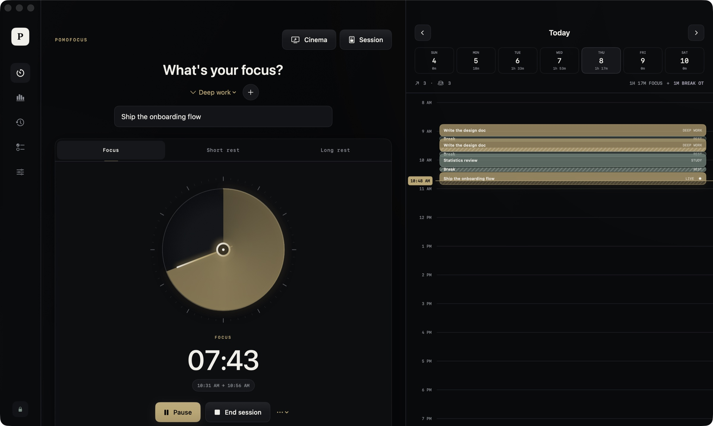
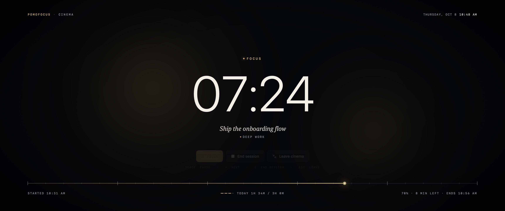

# Pomofocus

Pomofocus is a beautiful, local-first focus timer for macOS. It brings together clear intentions, flexible intervals, breaks, reflection, and useful analytics—without accounts, subscriptions, tracking, or cloud infrastructure.

> Piano piano. One meaningful thing at a time.

**[Download for Mac](https://github.com/CryptoChefA/pomofocus-mac/releases/latest/download/Pomofocus.zip)** · **[Website](https://cryptochefa.github.io/pomofocus-mac/)** · macOS 14+ · Apple silicon · free and open source





## Install

1. [Download `Pomofocus.zip`](https://github.com/CryptoChefA/pomofocus-mac/releases/latest/download/Pomofocus.zip) and unzip it.
2. Drag **Pomofocus** into **Applications**.
3. The build isn't notarized by Apple, so macOS blocks the first launch. Open **System Settings → Privacy & Security** and choose **Open Anyway**, or run:

   ```sh
   xattr -dr com.apple.quarantine /Applications/Pomofocus.app
   ```

## What works today

- Native SwiftUI macOS app and menu-bar timer with a live progress ring and countdown
- Native small, medium, and large desktop/sidebar widgets with a live timer and one restrained gold progress band
- Obsidian Atelier interface with graphite surfaces, champagne accents, and precision typography
- Split focus workspace with an analog timer dial and a dark daily timeline
- Cinema mode (⇧⌘F): a full-screen, screensaver-like scene for wide and ultrawide displays, with rolling digits, an unrolled minute tape, and a slowly drifting glow; keeps the display awake, Space pauses, → advances, Esc leaves
- Seven-day navigator with focus, break, and live-session blocks
- Break records with planned duration, actual duration, skipped status, and tracked overtime
- Hideable local session canvas for notes and image references
- Custom focus, short-break, and long-break durations
- Pause, resume, finish early, abandon, automatic breaks, and open-ended overtime
- End session (⌘.) in every state, including breaks and the Next prompt: keeps everything tracked and stops without starting anything new; Abandon now asks before discarding
- Configurable overtime reminder chime with one-click Next into the upcoming break
- Cockpit-style overtime alert: the time, status tag, and menu-bar item flash caution red (steady red with Reduce Motion, and switchable in Settings)
- Break-complete reminder with one-click Next straight into the next focus block
- Visible Skip break action that immediately begins the next focus session
- Task selection and fast task creation
- Lifetime focused hours and session count for every task
- Total focus time, distinct usage days, current streak, and longest streak
- Fourteen-day activity chart and twelve-week consistency heatmap
- Clickable dashboard metrics with dedicated 7, 30, and 90-day intelligence views, rolling trends, outcome distributions, task allocation, time-of-day patterns, and transparent metric definitions
- Insights with a 7, 30, 90-day or all-time range: week-over-week trend, six-month totals, daily goal hit rate, focus by hour and weekday, rating by task and start hour, completion rate, focus-to-break ratio, skipped breaks, and overtime trend
- Read-only calendar overlay on the day timeline through EventKit, so any account added to macOS (Google included) appears behind your sessions, with a per-calendar picker and Start focus from an event
- Intention and session notes
- Local session canvas with clipboard paste, drag-and-drop, and multi-image import
- Per-image resizing, captions, ordering, removal, and preserved history thumbnails
- Optional post-session focus rating and reflection
- Session celebration: when you press End session, screen-wide confetti and a cinematic breakdown of the whole sitting (every pomodoro, total focus, breaks, pauses, overtime, today vs goal, streak); single pomodoros pass quietly; switchable in Settings
- Three-cycle guided breathing ritual with animated inhale and exhale cues
- Local notifications and a locally generated bell ding for every timer cue
- Local focus ambience: soft ticking, layered natural rain, ocean waves, and brown noise
- Ambient volume, four-second preview, and automatic pause/resume with the timer
- Configurable daily goal and presence chime
- Searchable history and CSV export
- Timer recovery after quitting or restarting the app
- Human-readable local JSON storage
- Custom keyboard shortcuts and menu-bar controls

## Privacy

Pomofocus has no account system, telemetry, advertisements, analytics SDK, or networking code. The optional calendar overlay reads events that macOS already syncs to your Mac. macOS only offers full calendar access or none, so the system prompt says "full access", but the app contains no code that creates, edits, or deletes events. Its database lives at:

```text
~/Library/Application Support/Pomofocus/pomofocus-data.json
```

The Settings screen can reveal this file in Finder. Back it up, inspect it, transform it, or delete it whenever you choose.

Images added to the session canvas are stored locally beside it in:

```text
~/Library/Application Support/Pomofocus/Images/
```

Existing Pomodoro Nonna data is migrated into these paths automatically on the first Pomofocus launch.

## Run from source

Requirements: macOS 14 or newer and a Swift 6.2 toolchain (Xcode 26 or its Command Line Tools).

```sh
swift run
```

## Build the macOS app

```sh
chmod +x Scripts/build-app.sh
Scripts/build-app.sh
open "outputs/Pomofocus.app"
```

The script makes `outputs/Pomofocus-<version>.zip`, containing a local ad-hoc-signed application and its WidgetKit extension with stable designated requirements, plus an unpacked development copy. Keeping the app requirement stable prevents macOS calendar consent from being lost between local updates. The ZIP is the canonical local release because some file-provider folders attach metadata directly to exposed app bundles. A public release should use an Apple Developer ID and notarization.

Builds from this script are ad-hoc signed, not notarized. A build you make yourself opens normally; a downloaded one needs the **Open Anyway** step from [Install](#install).

The bundle identifiers (`org.pomodorononna.app` and `org.pomodorononna.app.widget`) live in `Resources/Info.plist`, `Resources/WidgetInfo.plist`, and `Scripts/build-app.sh`. Change all three if you ship your own fork.

## Check the analytics engine

The current command-line Swift installation does not bundle XCTest, so the core analytics checks are intentionally dependency-free:

```sh
mkdir -p .build/checks
swiftc Sources/PomodoroNonna/Models.swift Sources/PomodoroNonna/Insights.swift Sources/PomodoroNonna/DeepDiveAnalytics.swift Tests/AnalyticsCheck/main.swift -o .build/checks/analytics-check
.build/checks/analytics-check
```

## Architecture

- `AppModel.swift`: timer state machine, local session lifecycle, notifications, and sound lifecycle
- `AmbientSoundPlayer.swift`: locally generated, looping ambient soundscapes
- `CueSoundPlayer.swift`: locally generated bell ding for timer cues
- `Models.swift`: persistent records and pure analytics calculations
- `Insights.swift`: pure, range-filtered insight calculations (trends, time of day, quality, breaks)
- `InsightsView.swift`: the Insights section of the dashboard
- `DeepDiveAnalytics.swift`: 7/30/90-day intelligence calculations for dashboard drill-downs
- `MetricDeepDiveView.swift`: interactive metric detail sheets with rich charts and explanations
- `ChartHover.swift`: hover tooltips shared by every chart
- `CalendarStore.swift`: read-only EventKit access for the timeline overlay
- `LocalStore.swift`: atomic JSON persistence in Application Support
- `WidgetSnapshotWriter.swift`: private local timer snapshots and WidgetKit refreshes
- `PomofocusWidget.swift`: small, medium, and large macOS widget layouts
- `FocusView.swift`: main focus ritual and reflection
- `FocusCanvasView.swift`: local text, pasted images, captions, resizing, and ordering
- `CinematicMode.swift`: full-screen Cinema scene, with Core Animation backdrop and minute tape
- `CelebrationMode.swift`: end-of-sitting confetti and stats breakdown
- `DashboardView.swift`: local charts, lifetime task totals, streaks, and usage days
- `HistoryView.swift`: searchable session ledger and CSV export
- `TasksView.swift`: task library and lifetime totals
- `SettingsView.swift`: timer, rhythm, sound, and privacy controls

## Roadmap

The project deliberately starts with a reliable focus and analytics core. Suitable next releases include:

- Local distraction shield for selected macOS apps
- Optional open-source Safari/Chromium website-blocking extension
- Local calendar export
- Editable sessions and JSON import/export
- Task estimates and a lightweight “Today” queue
- Per-task profiles for intervals, sounds, and blocklists
- Additional locally generated ambient soundscapes
- Accessibility audit, localization, and full keyboard navigation
- Universal binary, Developer ID signing, notarization, and packaged releases

See [CONTRIBUTING.md](CONTRIBUTING.md) before proposing a change.

## License

MIT. Use it, fork it, improve it, and keep focus tools available to everyone.
